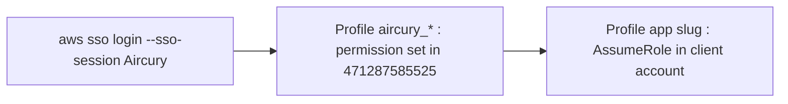
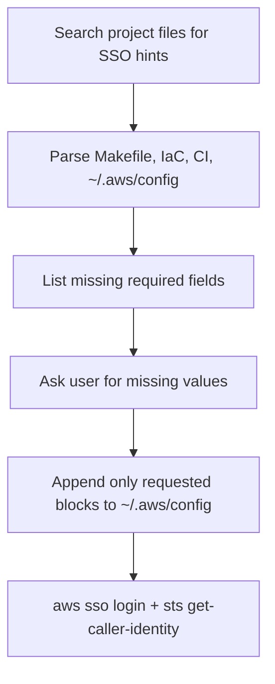

# Aircury AWS SSO (CLI)

## Architecture

Aircury uses **one IAM Identity Center** portal with **External AWS Account** apps. CLI access is almost always **two profiles**:



| Layer | Config block | Purpose |
|-------|----------------|---------|
| Session | `[sso-session Aircury]` | Shared browser login for all Aircury apps |
| SSO | `[profile aircury_<app>]` | `sso_session`, `sso_account_id`, `sso_role_name` |
| Jump | `[profile <app>]` | `role_arn`, `source_profile`, `role_session_name`, `external_id` |

**Constants (Aircury org):**

| Setting | Value |
|---------|--------|
| Portal URL | `https://aircury.awsapps.com/start` |
| `sso_region` | `eu-west-1` (Identity Center region) |
| Org / SSO account | `471287585525` (Aircury Technical) |
| Default `region` on profiles | Usually `eu-west-2` (workload region) |

## Daily login

**Prefer `--profile` on each command** instead of `export AWS_PROFILE` (explicit, safer across terminals and scripts).

```bash
aws sso login --sso-session Aircury

aws sts get-caller-identity --profile <work_profile>
aws s3 ls --profile <work_profile>
```

Equivalent login: `aws sso login --profile aircury_<app>` (same session).

Use `export AWS_PROFILE` only when a tool **does not** accept `--profile` (some Make targets, older scripts). Prefer passing profile in the command when possible.

**Do not** use long-lived access keys in `~/.aws/config`. SSO + assume role only.

## Add a new app profile

When adding profiles, **discover values from the project first**, then ask the user for anything still missing. Do not guess `external_id`, `role_arn`, or permission set names.

### Agent workflow



### Step 1 — Discover before asking

Search the **current project** (and `~/.aws/config` if readable) before asking the user.

1. **Makefile or equivalent** — task runners, package scripts, shell scripts, or docs that set `AWS_PROFILE`, define SSO setup targets, or document profile names.
2. **Serverless, CDK, Terraform, CloudFormation, or equivalent IaC** — account ids, role ARNs, `external_id`, and permission hints in infrastructure definitions and CI workflows.

Report what you found before asking the user.

### Step 2 — Required fields (ask only if still missing)

#### A. Direct access (org account only)

Single SSO profile — **no** jump block.

| Field | Required | Default / constant | Ask user if missing |
|-------|----------|--------------------|---------------------|
| `slug` | yes | — | Work profile name used by project scripts |
| `sso_role_name` | yes | — | Exact permission set from AWS portal or project docs |
| `region` | no | workload default | Only if project uses another region |

#### B. External AWS Account (typical — two profiles)

| Field | Profile block | Required | Default / constant | Ask user if missing |
|-------|---------------|----------|--------------------|---------------------|
| `slug` | both | yes | — | Work profile name |
| `sso_role_name` | `aircury_<slug>` | yes | — | Exact permission set for the External AWS Account app |
| `target_account_id` | jump | yes | — | Target account id from IaC or CI |
| `iam_role_name` | jump (`role_arn`) | yes | — | Role name from `role_arn` or Ia |
| `role_session_name` | jump | yes | — | User's `@aircury.com` email |
| `external_id` | jump | yes | — | From Ia, trust policy, or existing config — **never invent** |
| `region` | both | no | workload default | Only if project uses another region |

Constants (do not ask): values from **Constants (Aircury org)** above, plus `sso_session = Aircury`.

### Step 3 — Ask for missing values

Ask the user only for fields still missing after discovery. Do not proceed without `external_id` for external-account profiles.

Questions to resolve, when needed:

1. **Profile layout** — direct org SSO access or cross-account AssumeRole (two profiles)?
2. **`sso_role_name`** — exact permission set from AWS portal or Ia.
3. **`slug`** — work profile name (`AWS_PROFILE`) used by project scripts.
4. **`target_account_id`** — when multiple account ids appear in IaC or CI.
5. **`iam_role_name`** — when jump role is ambiguous.
6. **`role_session_name`** — user's `@aircury.com` email.
7. **`external_id`** — from Ia or target role trust policy; never invent.

### Step 4 — Write `~/.aws/config`

Naming convention:

- SSO: `aircury_<slug>`
- Work: `<slug>`

Ensure `[sso-session Aircury]` exists once (see constants above).

**Direct access template:**

```ini
[profile aircury_<slug>]
sso_session = Aircury
sso_account_id = 471287585525
sso_role_name = <PermissionSetName>
region = eu-west-2
```

**External account template:**

```ini
[profile aircury_<slug>]
sso_session = Aircury
sso_account_id = 471287585525
sso_role_name = <PermissionSetName>
region = eu-west-2

[profile <slug>]
role_arn = arn:aws:iam::<target_account_id>:role/<IamRoleName>
source_profile = aircury_<slug>
region = eu-west-2
role_session_name = <user>@aircury.com
external_id = <from Ia or trust policy>
```

### Step 5 — Verify

```bash
aws sso login --sso-session Aircury
aws sts get-caller-identity --profile <slug>
```

- **Direct:** `Account` should match the org SSO account.
- **External:** `Account` should be the target client account, not the org SSO account.

## Agent rules

1. **Never** commit `~/.aws/config`, access keys, or `external_id` values into git unless the team explicitly maintains a secrets-free template (placeholders only).
2. Prefer `aws sso login --sso-session Aircury`, then **`--profile <work profile>`** on every AWS CLI call (avoid `export AWS_PROFILE` unless the tool requires it).
3. Use `sso_region = eu-west-1` for SSO; do not confuse with `region = eu-west-2` for API calls.
4. When adding profiles, search the project first, then ask only for missing values.
5. When editing user config, only add blocks the user requested; preserve unrelated profiles.
6. If `AssumeRole` fails after SSO works, check `external_id` and `role_arn` first.
